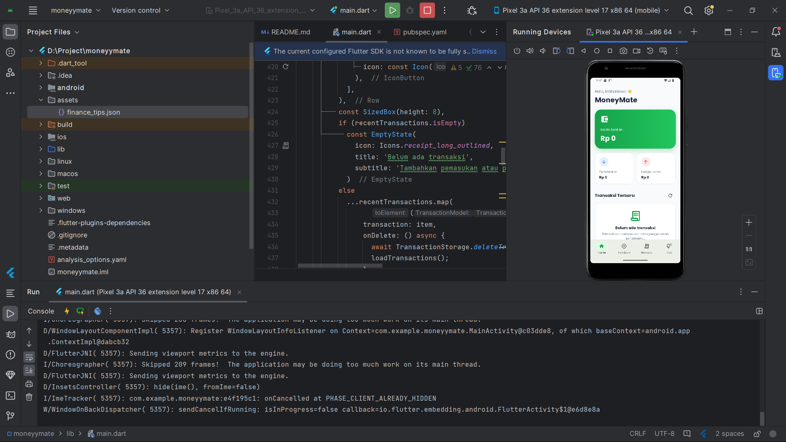
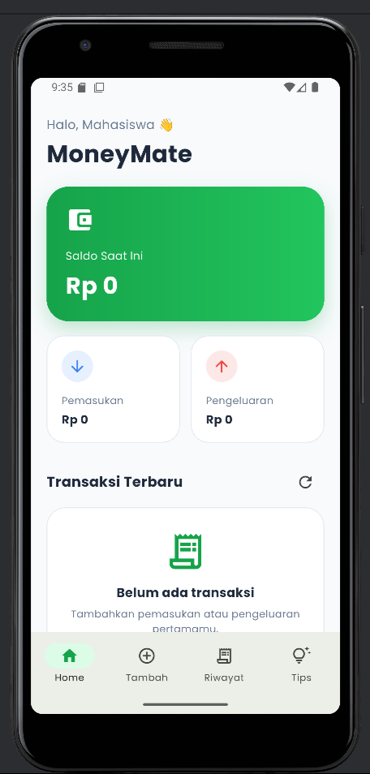
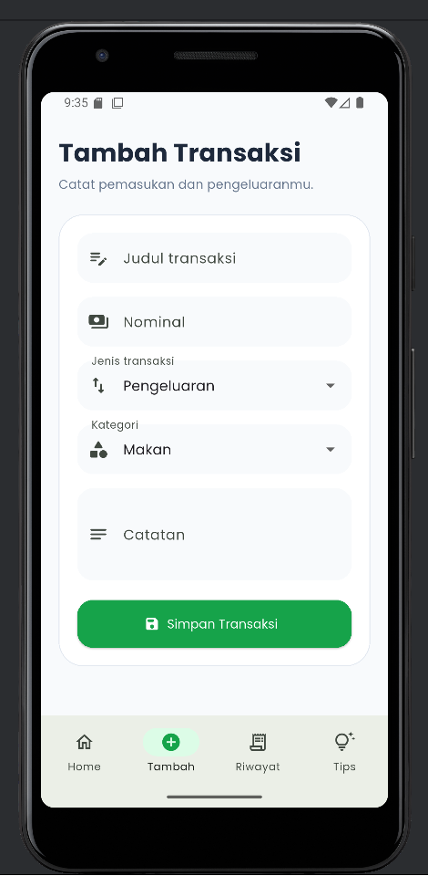
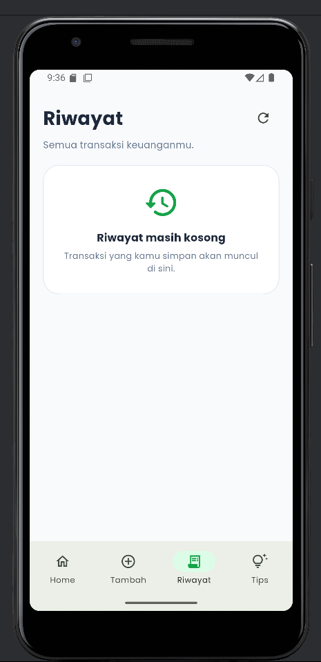

# MoneyMate

MoneyMate adalah aplikasi keuangan mahasiswa berbasis Flutter yang dibuat untuk membantu mahasiswa mencatat pemasukan, pengeluaran, melihat saldo, dan membaca tips keuangan sederhana dari data JSON lokal.

Aplikasi ini dibuat sebagai project UTS mata kuliah Pemrograman Mobile 2.

## Identitas Project

- Nama Aplikasi: MoneyMate
- Tema: Keuangan Mahasiswa
- Framework: Flutter
- Bahasa Pemrograman: Dart
- Platform: Android
- Penyimpanan Data: SharedPreferences
- JSON Parsing: Local JSON dari folder assets

## Deskripsi Aplikasi

MoneyMate membantu mahasiswa dalam mengelola uang harian secara sederhana. Pengguna dapat mencatat pemasukan seperti uang saku, beasiswa, atau freelance. Pengguna juga dapat mencatat pengeluaran seperti makan, transportasi, kebutuhan kuliah, hiburan, dan belanja.

Aplikasi ini juga menyediakan halaman tips keuangan mahasiswa yang datanya diambil dari file JSON lokal.

## Fitur Aplikasi

- Splash Screen
- Dashboard saldo
- Menampilkan total pemasukan
- Menampilkan total pengeluaran
- Menambahkan transaksi pemasukan
- Menambahkan transaksi pengeluaran
- Menampilkan riwayat transaksi
- Menghapus transaksi
- Menampilkan tips keuangan mahasiswa dari JSON lokal
- Penyimpanan transaksi secara lokal menggunakan SharedPreferences

## Teknologi yang Digunakan

- Flutter
- Dart
- Material Design
- SharedPreferences
- JSON Parsing
- Google Fonts
- Intl Currency Format

## Struktur Folder Project

```text
moneymate/
├── assets/
│   └── finance_tips.json
├── lib/
│   └── main.dart
├── screenshots/
│   ├── splash.png
│   ├── dashboard.png
│   ├── tambah.png
│   ├── riwayat.png
│   └── tips.png
├── pubspec.yaml
└── README.md
```
## User Interface

### Tampilan Android Studio


### Dashboard


### Tambah Transaksi


### Riwayat Transaksi


### Tips Keuangan


